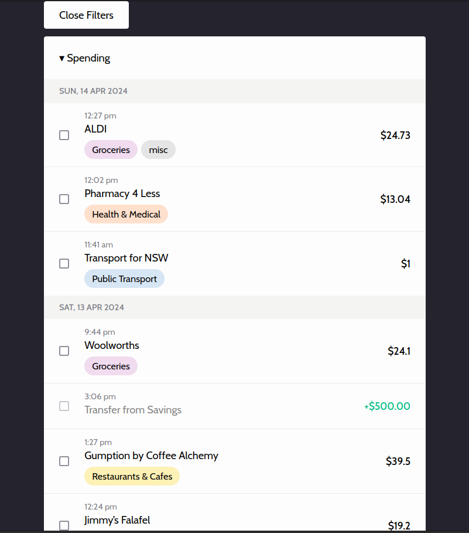

# Up Bank Transaction Tagger

Web app using [Up Bank API](https://developer.up.com.au/) to allow bulk tagging of
transactions.

## FAQ

### What's an API key?

Your API key uniquely identifies you with Up Bank. It allows anyone that knows your
API key to read your transactions and add/update tags and categories.

Go to [api.up.com.au](http://api.up.com.au) to get your API key!

### I see "Covered from X" or "Forwarded to X" transactions... what gives?

Covers and fowards are transactions under the hood. The Up app hides these transactions
under pretty UI but they're still there.

These transactions show up in the API but they don't mark which transaction they're
covering. I have an [open GitHub issue](https://github.com/up-banking/api/issues/99)
with Up to add this feature.

For now, this web app uses heuristics to find likely covers/forwards and displays them a similar
UI to the app.

### Can I shift select?

YES! The web app supports selecting multiple transactions in a row if you hold the shift key.
